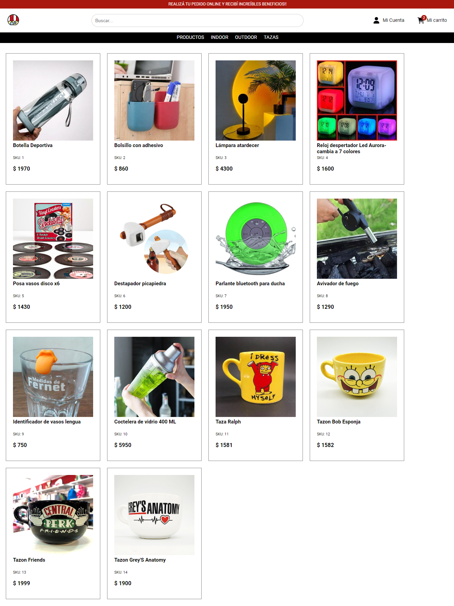

# Regalón - Tienda de regalos

Proyecto para curso de React JS.

### `Dependencias externas usadas`

Ninguna

### `Aplicación creada utilizando`

[Create React App](https://github.com/facebook/create-react-app)

### `Dependencias utilizadas`

- [React Router DOM](https://www.npmjs.com/package/react-router-dom)
- [SASS](https://www.npmjs.com/package/sass)

### `Documentación de dependencias`

- [React Router DOM](https://create-react-app.dev/)
- [SASS](https://create-react-app.dev/docs/adding-a-sass-stylesheet)

### `Pasos para correr el proyecto`

**Note: Recuerda encontrarte en la carpeta raíz del proyecto para realizar los siguientes pasos**

- Clona el proyecto desde github [Aquí](https://github.com/tecram/regalon-marcetcristian).
- Corre el comando 'npm install' para instalar todas las dependencias.
- Corre 'npm start' para levantar el proyecto.

### `Vista previa de homepage de proyecto`
